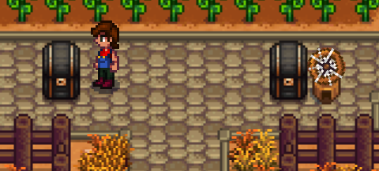

# Quantum Chests

A [SMAPI](https://smapi.io/) mod for Stardew Valley 1.6 that adds chests craftable in entangled pairs. Both chests in a pair always share one inventory, no matter where each half is placed - across the farm, in the mines, wherever.



## Features

- **Craft in pairs.** Every crafting recipe produces two chests at once, permanently entangled with each other.
- **Shared inventory.** Put an item in one chest, it's instantly available in its partner too - regardless of distance or location.
- **Two tiers.** Quantum Chest (normal capacity) and Big Quantum Chest (70-slot capacity, like a Big Chest).
- **Color-coded pairs.** Each pair is randomly dyed one of the vanilla chest colors the moment it's crafted, so you can tell pairs apart at a glance even before placing them. Recoloring one chest via the paint-can picker automatically recolors its partner too.
- **Visually familiar.** Uses the same sprites as a vanilla chest/big chest, so they fit right in - the dye color is what sets a pair apart.
- **The danger of quantum mechanics.** Picking up and carrying chests works exactly like vanilla. But if one chest of a pair is ever truly lost for good (not just picked up - genuinely destroyed, trashed, or otherwise made to cease existing), its entangled partner collapses out of existence too, taking the shared contents with it. There's no new way to destroy a chest added by this mod - regular chests are already immune to bombs and can't be broken with tools - but if it ever happens, the entanglement doesn't leave a dangling half behind.

## Recipes

| Item                | Ingredients                                   | Yield             |
|---------------------|-----------------------------------------------|-------------------|
| Quantum Chest       | 2 Chests + 2 Iridium Bar + 2 Battery Pack     | 1 pair (2 chests) |
| Big Quantum Chest   | 2 Big Chests + 4 Iridium Bar + 2 Battery Pack | 1 pair (2 chests) |

Both recipes are unlocked automatically as soon as a save is loaded - no level or quest requirement beyond having the materials.

## Installation

1. Install [SMAPI](https://smapi.io/).
2. Build this project (see below) or download a release build.
3. Drop the `QuantumChests` folder into your `Stardew Valley/Mods` folder.

## Development

Source lives outside the live `Mods` folder; building auto-deploys to it.

```
dotnet build
```

See `ARCHITECTURE.md` for how it's built and why.

## Compatibility

- Stardew Valley 1.6.15, SMAPI 4.5.2 (built and tested against these versions).
- No config options by design.
- Should be safe alongside other mods; uses Harmony patches scoped tightly to its own two item IDs, so it shouldn't affect vanilla items, chests, or other mods' items.
